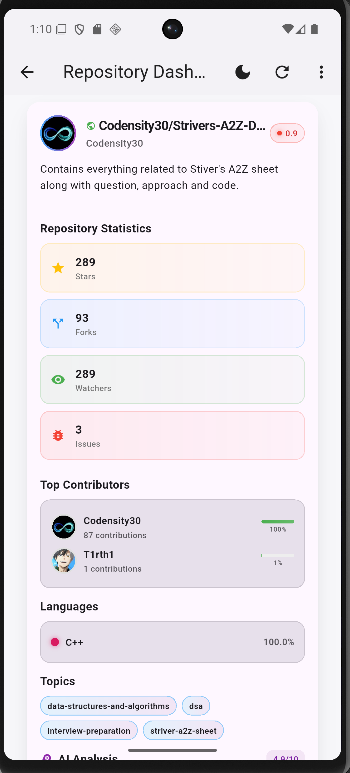
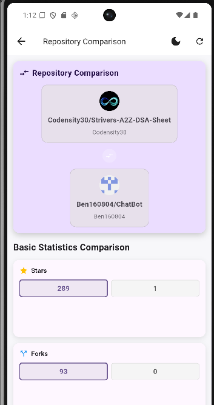

# GIT DIFF

A modern Flutter app to fetch, analyze, and compare GitHub repositories. It combines GitHub data, local caching, and AI-driven insights (Gemini) to present repository health, activity, and improvement suggestions in a clean, responsive UI.

- Track: Mobile App - Flutter
- State Management: GetX
- Architecture: MVC-esque (Screens + Controllers + Services + Widgets + Models)

## Table of Contents
- Getting Started
  - Prerequisites
  - Clone and Install
  - Environment Variables
  - Run the App
- How to Use
  - Home (Fetch repo)
  - Dashboard (Explore)
  - Compare Repositories
  - AI Analysis
  - Light/Dark Theme Toggle
- Project Structure
- Technical Choices and Rationale
- Troubleshooting

---

## Getting Started

### Prerequisites
- Flutter (3.x recommended). Install via: https://docs.flutter.dev/get-started/install
- Dart SDK (bundled with Flutter)
- A GitHub Personal Access Token (PAT) with public repo scope
- A Google Gemini API Key (for AI analysis)

Verify Flutter:
```bash
flutter --version
```

### Clone and Install
```bash
git clone https://github.com/Ben160804/Git_Diff.git
cd gitdiff
flutter pub get
```

### Environment Variables
Create a `.env` file in the project root with the following keys:
```
GEMINI_API_KEY=your_gemini_api_key
GITHUB_TOKEN=your_github_personal_access_token
```
Notes:
- Keep this file private. Do not commit your secrets.
- The app uses `flutter_dotenv` to load these keys at startup.

### Run the App
```bash
flutter run
```
Pick a device (Android/iOS/emulator/simulator) from the prompt if needed.

Build APK (optional):
```bash
flutter build apk --release
```

---

## How to Use

### Home (Fetch repo)
- Paste a public GitHub repository link (e.g., https://github.com/flutter/flutter).
- Tap “Fetch Repository Data”. The app retrieves repository metadata, contributors, languages, commit activity, and kicks off AI analysis.

### Dashboard (Explore)
- Shows the current repository in a detailed card (owner, description, activity, topics, languages, and AI Analysis widget).
- Pull-to-refresh and quick actions are available in the AppBar.
- History and filters help review previously fetched repositories.

### Compare Repositories
- At the top of the dashboard, paste another GitHub repo link and tap “Compare”.
- The comparison screen shows side-by-side stats, activity, contributors, and AI insights for both repositories.

### AI Analysis
- Powered by Google Gemini: summarizes repository, scores code quality/security/maintainability/architecture, and suggests improvements.
- The AI widget renders Markdown and adapts to screen size.

### Light/Dark Theme Toggle
- Tap the sun/moon icon in the AppBar on any main screen to toggle themes.
- The entire app (surfaces, text, cards, borders, inputs) adapts to the selected theme with proper contrast.

---

## Project Structure
```
lib/
  controllers/
    dashboard_controller.dart
    home_screen_controller.dart
    comparison_controller.dart
    theme_controller.dart
  models/
    repository_model.dart
    ...
  services/
    github_service.dart
    ai_analysis_service.dart
  screens/
    home_screen.dart
    dashboard_screen.dart
    comparison_screen.dart
  widgets/
    repo_info_card_widget.dart
    ai_analysis_widget.dart
  main.dart
```
- Screens (Views): Page UIs (Home, Dashboard, Comparison)
- Controllers: GetX controllers for screen logic and state
- Services: Network and AI integrations (GitHub REST, Gemini)
- Models: Hive-backed data models and DTOs
- Widgets: Reusable UI building blocks (repository card, AI analysis)

---

## Technical Choices and Rationale

- GetX (State & Navigation)
  - Lightweight, reactive, and simple dependency injection
  - `Obx` for reactive rebuilds; `Get.put`/`Get.find` for DI; `Get.toNamed` for routes

- MVC-esque Organization
  - Clear separation between views (Screens), logic/state (Controllers), data access (Services), and domain (Models)
  - Improves maintainability and testing

- Hive (Local Persistence)
  - Fast, type-safe local storage for repositories and AI insights
  - Offline-friendly and simple adapters

- GitHub API (REST)
  - Fetch repo details, contributors, commit activity, languages, README (when relevant)
  - Auth via PAT to improve rate limits and stability

- Google Gemini (AI Analysis)
  - Summaries, scoring, and suggestions for the repository
  - Integrated with robust initialization checks and error handling

- flutter_markdown
  - Rich formatting for AI-generated content
  - Styling adapted to screen size and theme

- Responsive & Theming
  - MediaQuery and LayoutBuilder for responsive breakpoints
  - Material 3 with seeded ColorScheme
  - Theme-aware colors for surfaces, borders, and text (light/dark)

---

## Troubleshooting

- Missing .env keys
  - Ensure `.env` exists with `GEMINI_API_KEY` and `GITHUB_TOKEN`
  - Logs will warn if keys are missing; AI features require valid keys

- GitHub API limits
  - Use a PAT; avoid hitting rate limits; check logs for 403 errors

- AI widget overflow or long text
  - The widget is responsive and uses Markdown; if you see overflow, try a larger device or rotate

- Build errors after pulling changes
  - Run `flutter clean && flutter pub get`
  - Ensure your Flutter channel is up to date: `flutter upgrade`


---
## Screenshots of the Application





---


